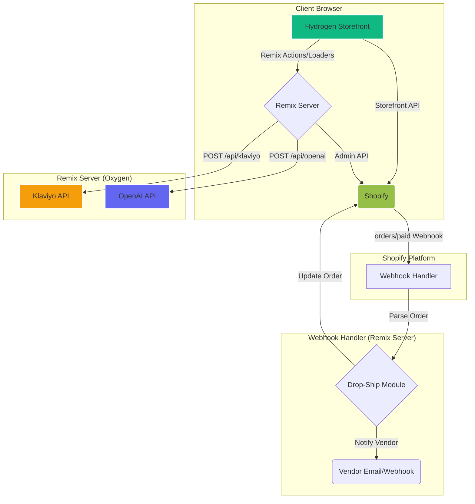

# Axiom Metabolic — Remote Health-Tech Platform

**Lead Systems Architect & Senior Full-Stack Developer: Manus AI**

This repository contains the complete codebase for the Axiom Metabolic headless Shopify storefront, built with the Hydrogen framework (React/Remix). It includes a full suite of features for a 100% remote weight loss coaching business.

---

## Table of Contents

1.  [Core Features](#core-features)
2.  [Technical Architecture](#technical-architecture)
3.  [Project Structure](#project-structure)
4.  [Local Development Setup](#local-development-setup)
5.  [Deployment Instructions](#deployment-instructions)
6.  [Post-Deployment Checklist](#post-deployment-checklist)

---

## Core Features

| Feature | Description |
| :--- | :--- |
| **Headless Hydrogen Storefront** | A high-performance, app-like storefront built on Shopify Hydrogen, completely decoupled from the Shopify theme editor. |
| **Biometric Progress Engine** | A secure customer dashboard where clients can log daily/weekly biometrics (weight, BMI, body fat %, etc.). Data is stored directly on the Shopify Customer object via Metafields. Includes Chart.js for visualizing progress trends. |
| **AI Coach (The Brain)** | An integrated OpenAI-powered coach that provides 24/7 protocol support. It is trained on your specific coaching voice and can access a client's biometric data to provide personalized feedback. Includes an "Escalate to Human" flag for complex issues. |
| **Tiered Subscription Checkout** | A custom, multi-step checkout flow. Clients first select a coaching package (AI-only, Bi-weekly Zoom, Weekly Zoom) which is added as a recurring subscription. They then select their Ideal Protein food items, which are added as a one-time purchase. |
| **Drop-Ship Fulfillment Automation** | The backend is configured for zero-inventory fulfillment. Upon successful payment, a webhook automatically triggers a notification to your vendor (via email or webhook) to ship the order. |
| **Smart SMS Infrastructure** | Integrated with Klaviyo for data-driven, automated SMS campaigns. Triggers include inactivity alerts, milestone celebrations, weight log reminders, and order status updates. |

---

## Technical Architecture

-   **Framework**: [Shopify Hydrogen](https://hydrogen.shopify.dev/) (Remix)
-   **Language**: TypeScript
-   **Styling**: Plain CSS with CSS Modules
-   **Hosting**: [Shopify Oxygen](https://www.shopify.com/oxygen) (recommended)
-   **Shopify APIs**:
    -   Storefront API (for frontend data)
    -   Admin API (for metafields, webhooks, product creation)
-   **AI Coach**: OpenAI Chat Completions API
-   **SMS**: Klaviyo API
-   **Charts**: Chart.js

### Data Flow Diagram



---

## Project Structure

```
/axiom-metabolic
├── /scripts                # Setup & automation scripts (run once)
│   ├── setup-store.ts      # Creates products, webhooks, etc.
│   └── check-inactivity.ts # Scheduled job for SMS alerts
├── /storefront             # The Hydrogen application
│   ├── /app
│   │   ├── /components     # Reusable React components
│   │   ├── /lib            # Core business logic & API clients
│   │   │   ├── /fulfillment
│   │   │   ├── /klaviyo
│   │   │   ├── /openai
│   │   │   └── /shopify
│   │   ├── /routes         # Remix routes (pages and API endpoints)
│   │   │   ├── /account    # Customer dashboard routes
│   │   │   ├── /api        # Server-side API endpoints
│   │   │   └── coaching.tsx # Tier selection page
│   │   └── /styles         # CSS stylesheets
│   ├── /public             # Static assets (images, fonts)
│   ├── .env                # Local environment variables (DO NOT COMMIT)
│   ├── package.json
│   └── remix.config.js
└── README.md               # This file
```

---

## Local Development Setup

Follow these steps to run the application on your local machine.

**Prerequisites:**

-   [Node.js](https://nodejs.org/en/) (v18.0 or higher)
-   [pnpm](https://pnpm.io/installation)

**1. Clone the Repository**

```bash
git clone <your-repo-url>
cd axiom-metabolic/storefront
```

**2. Install Dependencies**

```bash
pnpm install
```

**3. Configure Environment Variables**

Copy the `.env` file in the `/storefront` directory and fill in the required API keys and tokens. The Shopify tokens are already pre-filled for the `axiom-metabolic` development store.

```bash
# /storefront/.env

# Shopify
SESSION_SECRET="your-random-session-secret"
PUBLIC_STORE_DOMAIN="axiom-metabolic.myshopify.com"
PUBLIC_STOREFRONT_API_TOKEN="YOUR_STOREFRONT_API_TOKEN"
SHOPIFY_ADMIN_API_TOKEN="YOUR_SHOPIFY_ADMIN_API_TOKEN"

# OpenAI (use your own key)
OPENAI_API_KEY="sk-..."

# Klaviyo (get from your Klaviyo account)
KLAVIYO_PRIVATE_API_KEY="pk_..."
KLAVIYO_PUBLIC_API_KEY="..."

# Drop-Ship Vendor (set one)
VENDOR_EMAIL="vendor@example.com"
VENDOR_WEBHOOK_URL=""
```

**4. Run the Development Server**

This command starts the local development server, which provides hot-reloading and a local proxy to the Shopify APIs.

```bash
pnpm dev
```

The application will be available at `http://localhost:3000`.

---

## Deployment Instructions

This application is designed to be deployed to **Shopify Oxygen**, Shopify's serverless hosting platform for Hydrogen storefronts.

For detailed, step-by-step instructions, please see `DEPLOYMENT.md`.

---

## Post-Deployment Checklist

After deploying the application for the first time, you must complete these steps:

1.  **Connect GitHub Repository**: In your Shopify Admin, go to `Hydrogen` > `Storefronts` and connect your GitHub repository to enable automatic deployments on every push.

2.  **Set Production Environment Variables**: In the Oxygen storefront settings, add all the environment variables from your `.env` file as production secrets.

3.  **Run the Store Setup Script**: You need to register the production webhooks. Run the setup script with your production domain.

    ```bash
    # Run from your local machine, pointed at production
    SHOPIFY_ADMIN_API_TOKEN=shpat_... \
    PRODUCTION_URL=https://your-axiom-domain.com \
    npx tsx scripts/setup-store.ts
    ```

4.  **Import Products**: Use the Shopify Admin to import your Ideal Protein food products via CSV.

5.  **Publish Coaching Products**: The three coaching tier products were created as `DRAFT`. Go to `Products` in your Shopify Admin, review them, and set their status to `ACTIVE`.

6.  **Configure Klaviyo Flows**: See `KLAVIYO_SETUP.md` for instructions on creating the SMS automation flows that respond to the events sent by the application.

7.  **Set Up Scheduled Jobs**: The `scripts/check-inactivity.ts` script needs to be run on a daily schedule. You can use a service like [GitHub Actions Scheduler](https://github.com/marketplace/actions/schedule), [EasyCron](https://www.easycron.com/), or a simple server cron job to `POST` to a webhook trigger URL that runs this script.
